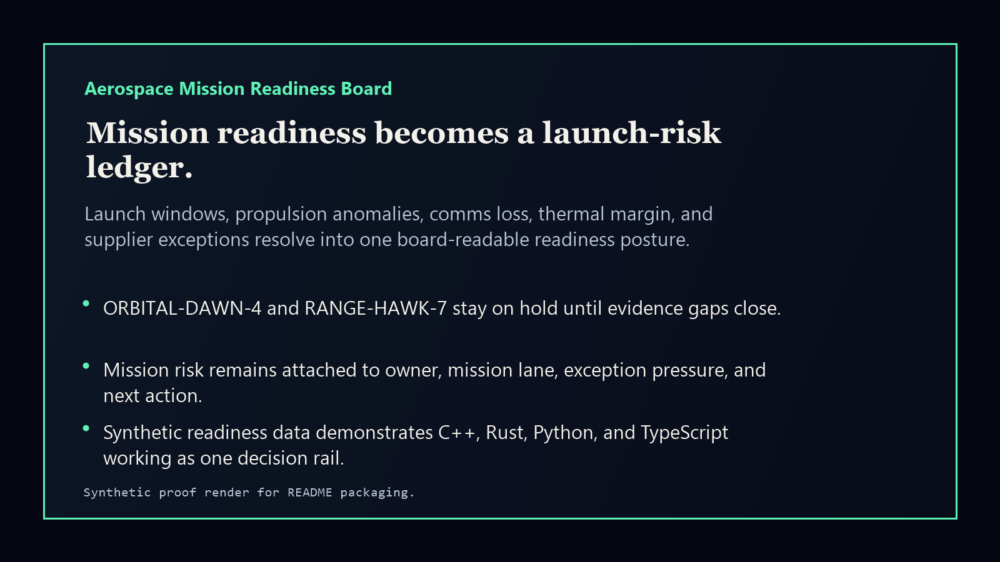
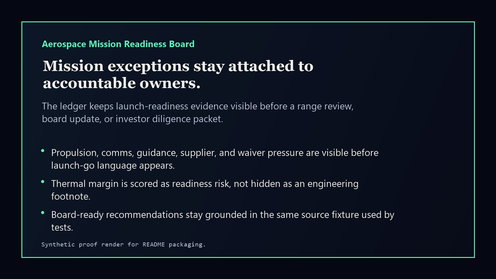

# aerospace-mission-readiness-board

[](https://github.com/mizcausevic-dev/aerospace-mission-readiness-board/actions/workflows/ci.yml)
[](https://github.com/mizcausevic-dev/aerospace-mission-readiness-board/actions/workflows/pages.yml)
[](LICENSE)

Aerospace Mission Readiness Board is an aerospace and defense control-plane prototype for turning launch-window pressure, propulsion anomalies, thermal margin, comms loss, guidance findings, supplier exceptions, and safety waivers into a board-readable mission-readiness ledger.

It is built to create clear portfolio signal across C++, Rust, Python, and TypeScript while staying aligned with the Kinetic Gain pattern: raw operational complexity becomes an evidence-backed decision surface.

## Why this exists

- Aerospace and defense programs fail quietly when mission assurance, supplier exceptions, flight software, and comms telemetry live in separate review packets.
- Operators need one owner-visible view before a launch-readiness review, range review, board update, or investor diligence packet.
- Boards need to know whether a mission is launch-go, watch-only, or hold because evidence gaps are still unresolved.

## What it ships

- C++ embedded-style mission risk scorer for launch and flight-readiness records.
- Rust normalizer that converts mission lanes into readiness events.
- Python readiness-pack generator for board and mission-assurance narratives.
- TypeScript scoring library, tests, CLI, and static web board.
- Synthetic fixtures, docs, screenshots, and GitHub Pages release rail.

## Product depth

Aerospace Mission Readiness Board turns fragmented mission-assurance evidence into a launch-readiness decision surface. It is designed for program leaders, mission owners, platform engineers, safety reviewers, supplier managers, and diligence readers who need to see whether a mission lane is ready, watch-only, or blocked before a launch-window or board-review moment.

For non-technical readers, it answers: where is the mission exposed, which evidence gap is driving the hold, what owner owns the next action, and what story can leadership responsibly tell? For technical reviewers, it shows a multi-language implementation pattern: C++ scoring, Rust normalization, Python narrative pack generation, TypeScript tests/CLI, static Pages output, fixtures, screenshots, and validation commands.

## What these repos have in common

This repo follows the Kinetic Gain control-plane pattern:

- name the operational ambiguity instead of hiding it inside screenshots or generic landing-page copy
- expose the decision surface as UI, JSON payloads, docs, screenshots, and validation commands
- connect GTM value, product narrative, technical proof, and executive review into the same public artifact
- keep public demos synthetic and safe while preserving enough structure to show how a real deployment would work

## Operating workflow

1. Score mission lanes against launch-window, telemetry, supplier, safety, and owner-readiness evidence.
2. Normalize raw mission findings into reviewable readiness events.
3. Generate a board-readable readiness pack that separates go, watch, and hold decisions.
4. Publish only synthetic demonstration data while keeping the artifact structure realistic enough for diligence review.

## Routes

- `/` - static public board
- `/api/missions` - JSON summary when run locally with Express

## Local run

```powershell
npm install
npm run verify
npm run prerender
npm run smoke
```

## CLI

```powershell
npm run demo
python python/aerospace_mission_board/pack.py fixtures/mission-readiness.json --format markdown
clang++ -std=c++20 cpp/mission_score.cpp -o cpp/mission_score.exe
./cpp/mission_score.exe fixtures/mission-readiness.json
cargo test --manifest-path crates/mission-normalizer/Cargo.toml
```

## Screenshots





## Security

This repo uses synthetic mission-readiness data only. Do not commit export-controlled details, mission identifiers from real programs, precise telemetry, safety incident records, customer data, credentials, or production defense data.
